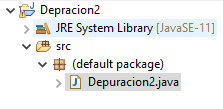
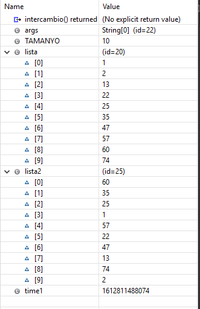
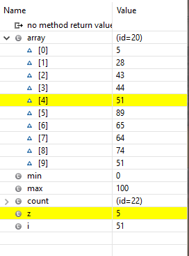

# Tarea 5 

###### Jorge Jankovich Ramos - 2021

Dado el proyecto eclipse adjunto, comprobad mediante depuración del sistema:

#### 0. Importar el proyecto en vuestro WorkSpace de Eclipse.
 

#### 1. Explicar QUÉ HACE EL MÉTODO MAIN.

 El metodo main crea 2 arrays con una longitud fija e va llamando a varios métodos para rellenarlos con números aleatorios, imprimir las listas sin ordenar, mostrar la lista ordenada y el tiempo que ha tardado en ordenarse.
 
 
 #### 2. Poner un punto de ruptura (breakpoint) en la línea 78 (primer bucle del método intercambio) y, basándoos en los valores que van tomando las variables, explicad cómo funciona el método de ordenación de arrays por intercambio. Podéis crear tablas para ver cómo cambian los valores de los arrays
 
 El bucle anidado recorre el array hasta encontrar un valor menor que el valor en primera posición y la cambia, hasta encontrar el valor mas pequeño y pasa a recorrer el array para recoger el siguiente valor mas pequeño ignorando el anterior. Así sucesivamente hasta que la lista tenga un array ordenado de menor a mayor del array 2. Esta funcion
 

 #### 3. Poner un punto de ruptura (breakpoint) en la línea 94 y explicad cómo funciona el método de ordenación de arrays de conteo. Podéis crear tablas para ver cómo cambian los valores de los arrays
 
 Esta función cuenta del 0 al 100 y compara el valor del contador con el valor de cada posición del array. Si un numero no coindide con ninguno del array pasa al siguiente, si un número del array coincide con el del contador, este se coloca el la primera posición y el contador continúa, esta vez para encontrar el numero de la siguiente posición. 

